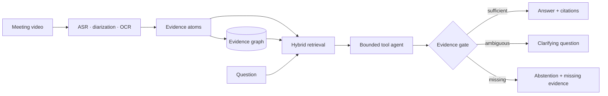

# EvidenceAgent-MM

Evidence-grounded multimodal assistance for noisy meetings and classrooms.

> Ask *who proposed what, when, and which slide was visible*. The system answers with claim-level citations, timestamps, speaker/page provenance, confidence, and a tool trace. If the evidence is ambiguous or insufficient, it asks a targeted question or abstains.

[中文说明](README.zh-CN.md) · [Architecture](docs/ARCHITECTURE.md) · [Dataset card](docs/DATASET_CARD.md) · [Model card](docs/MODEL_CARD.md) · [Security](SECURITY.md)

## Why this is not another summary demo

Conventional meeting RAG loses speaker, time, and screen relationships when it splits transcripts into fixed token chunks. EvidenceAgent-MM keeps those relationships in typed `EvidenceAtom` objects and an explicit evidence graph. The answer contract has three states:

- `answered`: every claim is backed by one or more replayable citations;
- `needs_clarification`: the question can become answerable after a precise follow-up;
- `abstained`: required evidence is absent or support is below the validation threshold.

The default agent is deterministic and auditable. Optional adapters add faster-whisper, BGE-M3, PaddleOCR, pyannote, and Qwen3-8B without making the core test suite depend on GPU libraries.

## Architecture



## Quick start

```bash
python -m venv .venv
source .venv/bin/activate
python -m pip install -e '.[dev]'

eamm make-benchmark benchmarks/eamm_bronze --sessions 12
eamm --db /tmp/eamm.db benchmark benchmarks/eamm_bronze \
  --output /tmp/eamm_metrics.json

eamm --db /tmp/eamm.db serve --host 127.0.0.1 --port 8000
```

Open `http://127.0.0.1:8000`. The demo binds to localhost by default because v0.1 has no authentication.

## Reproduce the Bronze benchmark

`EAMM-Bench Bronze` is a CC0 synthetic contract benchmark: 12 sessions and 120 questions, including 60% answerable, 20% clarifiable, and 20% unanswerable cases. It validates control flow and evidence accounting, not real-world accuracy.

```bash
make benchmark
```

Verified CPU baseline (Python 3.11, July 20, 2026):

| Metric | Value | Interpretation |
|---|---:|---|
| Questions | 120 | 12 synthetic sessions |
| Three-state status accuracy | 1.000 | contract benchmark only |
| Evidence Recall@5 | 1.000 | gold evidence appears in top five |
| Mean latency | 2.15 ms | deterministic local baseline |
| P95 latency | 2.47 ms | excludes model inference |
| ECE-10 | 0.413 | uncalibrated; intentionally reported as a limitation |

The exact report is in `benchmarks/results/cpu_bronze.json`. GPU reports are generated by the scripts below and must include the model revision and device manifest before their numbers are quoted.

The deterministic ablation report is in `benchmarks/results/ablations.json`. Restricting retrieval to top-1 reduces Evidence Recall@5 to 0.5 and three-state accuracy to 0.2. Removing graph expansion or the visual gate has no measurable effect on Bronze because every session contains only three clean atoms; this negative result is why the dataset card does not present Bronze as a graph-reasoning benchmark.

## 4090 model checks

```bash
bash scripts/install_gpu_env.sh
python scripts/generate_demo_media.py
python scripts/gpu_asr_smoke.py data/raw/demo_meeting/meeting.mp4
python scripts/bge_smoke.py
python scripts/qwen_smoke.py
```

The installer pins the official PyTorch 2.10.0 CUDA 12.8 wheel. Installing the newest default wheel on the verified AutoDL image selected CUDA 13.0 and correctly failed the CUDA availability gate against driver 570.124.04.

PaddleOCR and pyannote live in isolated optional environments because their CUDA/dependency matrices can conflict. Pyannote Community-1 requires accepting its model terms and a Hugging Face token; the token is read from the environment and must never be committed.

Verified RTX 4090 smoke results:

| Component | Result | Cached runtime | Artifact |
|---|---|---:|---|
| faster-whisper small | 2 segments, WER 0.125 | 4.42 s for 12.4 s media | `benchmarks/results/gpu/asr_small_4090.json` |
| BGE-M3 | cross-lingual target ranked 1st, score 0.625 | 25.17 s load + encode | `benchmarks/results/gpu/bge_m3_4090.json` |

The synthetic voice is intentionally difficult and WER includes number-format differences. These are integration measurements, not corpus-level model claims.

Local API load smoke (`200` requests, concurrency `16`) completed with zero failures, about `144.7 req/s`, and `235.8 ms` P95. This measurement uses the deterministic CPU retriever and excludes GPU model calls; see `benchmarks/results/api_load_local.json`.

## API

| Method | Route | Purpose |
|---|---|---|
| `GET` | `/health` | versioned health probe |
| `POST` | `/v1/sessions/import-fixture` | validate and ingest typed evidence |
| `POST` | `/v1/query` | execute retrieval, gate, and three-state response |
| `GET` | `/v1/evidence/{evidence_id}` | fetch a citation atom |

Every request is validated with Pydantic; SQLite queries are parameterized; unknown evidence returns 404. See `/docs` for OpenAPI.

## Repository map

```text
src/evidenceagent_mm/   schemas, graph, retrieval, agent, API, optional adapters
scripts/                media generation and real-model smoke tests
benchmarks/             redistributable Bronze metadata and verified reports
tests/                  unit, API, security-boundary, and benchmark tests
docs/                   architecture, dataset/model cards, design system
data/                   raw/interim/processed/external local layers (ignored)
results/                recomputable local runs (ignored)
```

## Quality gates

```bash
ruff check .
ruff format --check .
pytest --cov=evidenceagent_mm --cov-report=term-missing
python -m build
```

`uv.lock` pins the universal dependency graph. The AutoDL CUDA environment must still be created with `scripts/install_gpu_env.sh` so PyTorch comes from the official cu128 index.

The current core suite contains 20 tests and enforces 80% branch-aware coverage. Optional model adapters are verified by explicit integration scripts on the target GPU.

## Scope and safety

- Speaker IDs are anonymous by default; the project does not infer real identity.
- Private audio/video, credentials, model caches, and generated databases are excluded from Git.
- The demo has no authentication and must not be exposed directly to the public internet.
- Numerical claims are split into synthetic contract results and real-model integration results.

## License

Code is Apache-2.0. Synthetic benchmark metadata is CC0-1.0. Third-party models and corpora retain their upstream licenses; see [THIRD_PARTY_NOTICES.md](THIRD_PARTY_NOTICES.md).
