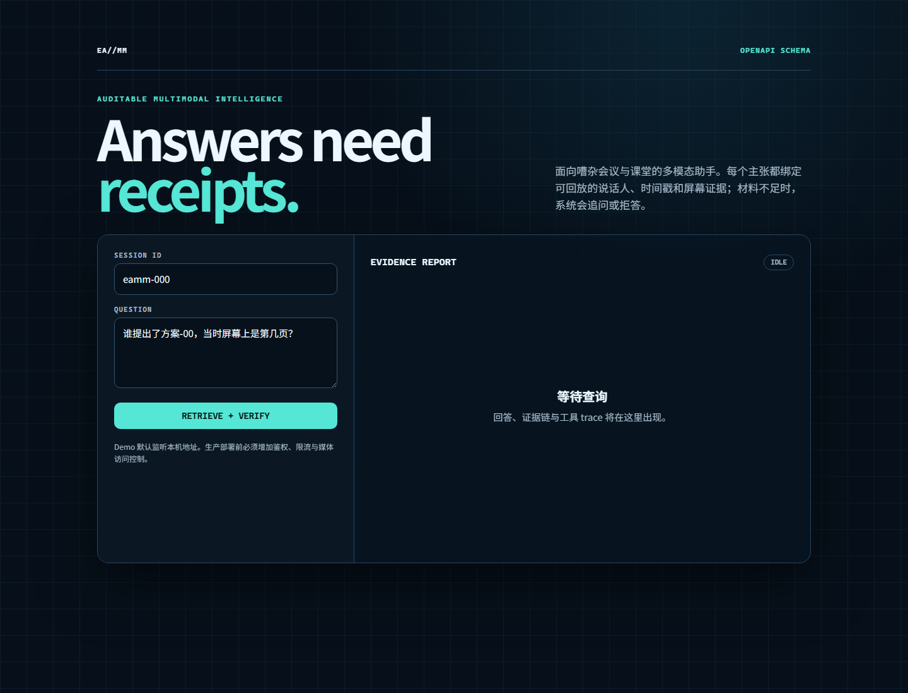
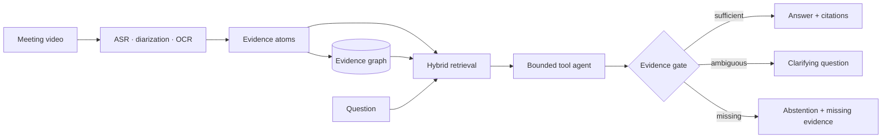

# EvidenceAgent-MM

[](https://github.com/Jatshi/EvidenceAgent-MM/actions/workflows/ci.yml)
[](https://huggingface.co/jatshi/EvidenceAgent-MM-Qwen3-1.7B-GRPO-LoRA)

Evidence-grounded multimodal assistance for noisy meetings and classrooms.

> Ask *who proposed what, when, and which slide was visible*. The system answers with claim-level citations, timestamps, speaker/page provenance, confidence, and a tool trace. If the evidence is ambiguous or insufficient, it asks a targeted question or abstains.

## EvidenceAgent-MM 2.0

Version 2.0 adds a post-training and data-flywheel layer without replacing the
auditable deterministic agent or changing the existing `/v1` API:

- versioned Pydantic/JSONL contracts for SFT, DPO, and GRPO;
- deterministic training-data construction with session-level splits;
- audio/ASR/acoustic attributes preserved in every evidence prompt;
- offline-verifiable format, status, citation, grounding, and abstention rewards;
- model-native chat templates with Qwen3 thinking disabled for constrained JSON;
- chained SFT -> DPO -> GRPO adapters rather than three disconnected base-model runs;
- consent-gated, deduplicated hard-case feedback export;
- optional TRL/Transformers LoRA training for a single 24 GiB RTX 4090;
- one-command AutoDL bootstrap, preflight, smoke run, and full run.

The local repository contains complete runnable code and dependency-light dry-run
validation. Machine-specific neural-training metrics are accepted only when the
corresponding AutoDL run manifest and adapter artifact are present.

```bash
# Local: build and validate all contracts without Torch/TRL.
python scripts/build_v2_training_data.py
python scripts/train_v2.py --config configs/sft_4090.json --dry-run
python scripts/train_v2.py --config configs/dpo_4090.json --dry-run
python scripts/train_v2.py --config configs/grpo_4090.json --dry-run

# AutoDL: after copying the repository to the instance.
bash scripts/autodl_v2_bootstrap.sh
bash scripts/autodl_v2_preflight.sh
PORTFOLIO_V2_MODE=smoke bash scripts/autodl_v2_run.sh
PORTFOLIO_V2_MODE=full bash scripts/autodl_v2_run.sh

# Chaining is on by default. These explicit inputs also support a resumed stage.
EAMM_GRPO_MODEL=/root/autodl-tmp/eamm-v2/dpo \
  EAMM_V2_STAGES=grpo PORTFOLIO_V2_MODE=full \
  bash scripts/autodl_v2_run.sh

# Optional DeepSpeed launcher. world_size=1 is only a compatibility smoke test.
EAMM_DEEPSPEED=zero2 EAMM_WORLD_SIZE=1 PORTFOLIO_V2_MODE=smoke \
  bash scripts/autodl_v2_run.sh

# Future multi-GPU acceptance run on a machine that actually has >=2 GPUs:
EAMM_DEEPSPEED=zero3 EAMM_WORLD_SIZE=2 PORTFOLIO_V2_MODE=smoke \
  bash scripts/autodl_v2_run.sh

# Only after a completed run manifest and adapter exist:
HF_TOKEN=... python scripts/publish_v2_adapter.py \
  --artifact-dir /root/autodl-tmp/eamm-v2/grpo \
  --repo-id jatshi/EvidenceAgent-MM-Qwen3-1.7B-GRPO-LoRA
```

See [the v2 training guide](docs/TRAINING_V2.md) and
[the implementation plan](PROJECT_PLAN.md) for exact contracts, reward formulas,
artifacts, and acceptance gates.

DeepSpeed is an optional `distributed` dependency. The AutoDL bootstrap installs
it by default; set `EAMM_INSTALL_DEEPSPEED=0` to skip it. Supported checked
configurations are ZeRO-2 optimizer CPU offload and ZeRO-3 optimizer/parameter CPU
offload under `configs/deepspeed/`. DeepSpeed runs deliberately disable 4-bit
weights: this repository does not claim that bitsandbytes-quantized parameters can
be safely partitioned by ZeRO. CPU offload also trades GPU memory for host RAM and
transfer latency, so it is not automatically faster—or necessary—for Qwen3-1.7B
on one 4090.



[中文说明](README.zh-CN.md) · [From-scratch tutorial](docs/tutorials/evidenceagent_mm_from_scratch_tutorial.md) · [Qwen3-1.7B GRPO LoRA](https://huggingface.co/jatshi/EvidenceAgent-MM-Qwen3-1.7B-GRPO-LoRA) · [Architecture](docs/ARCHITECTURE.md) · [Dataset card](docs/DATASET_CARD.md) · [Model card](docs/MODEL_CARD.md) · [Security](SECURITY.md)

## Why this is not another summary demo

Conventional meeting RAG loses speaker, time, and screen relationships when it splits transcripts into fixed token chunks. EvidenceAgent-MM keeps those relationships in typed `EvidenceAtom` objects and an explicit evidence graph. The answer contract has three states:

- `answered`: every claim is backed by one or more replayable citations;
- `needs_clarification`: the question can become answerable after a precise follow-up;
- `abstained`: required evidence is absent or support is below the validation threshold.

The default agent remains deterministic and auditable. Optional adapters add faster-whisper, BGE-M3, PaddleOCR, pyannote, Qwen3 generation, and TRL post-training without making the core test suite depend on GPU libraries.

## Architecture


```mermaid
flowchart LR
    M[Meeting video] --> P[ASR · diarization · OCR]
    P --> A[Evidence atoms]
    A --> G[(Evidence graph)]
    A --> H[Hybrid retrieval]
    G --> H
    Q[Question] --> H
    H --> T[Bounded tool agent]
    T --> V{Evidence gate}
    V -->|sufficient| R[Answer + citations]
    V -->|ambiguous| C[Clarifying question]
    V -->|missing| X[Abstention + missing evidence]
```

## Quick start

```bash
python -m venv .venv
source .venv/bin/activate
python -m pip install -e '.[dev]'

eamm make-benchmark benchmarks/eamm_bronze --sessions 12
eamm --db /tmp/eamm.db benchmark benchmarks/eamm_bronze \
  --output /tmp/eamm_metrics.json

eamm --db /tmp/eamm.db serve --host 127.0.0.1 --port 8000
```

Open `http://127.0.0.1:8000`. The demo binds to localhost by default because v0.1 has no authentication.

## Reproduce the Bronze benchmark

`EAMM-Bench Bronze` is a CC0 synthetic contract benchmark: 12 sessions and 120 questions, including 60% answerable, 20% clarifiable, and 20% unanswerable cases. It validates control flow and evidence accounting, not real-world accuracy.

```bash
make benchmark
```

Verified CPU baseline (Python 3.11, July 20, 2026):

| Metric | Value | Interpretation |
|---|---:|---|
| Questions | 120 | 12 synthetic sessions |
| Three-state status accuracy | 1.000 | contract benchmark only |
| Evidence Recall@5 | 1.000 | gold evidence appears in top five |
| Mean latency | 2.15 ms | deterministic local baseline |
| P95 latency | 2.47 ms | excludes model inference |
| ECE-10 | 0.413 | uncalibrated; intentionally reported as a limitation |

The exact report is in `benchmarks/results/cpu_bronze.json`. GPU reports are generated by the scripts below and must include the model revision and device manifest before their numbers are quoted.

The deterministic ablation report is in `benchmarks/results/ablations.json`. Restricting retrieval to top-1 reduces Evidence Recall@5 to 0.5 and three-state accuracy to 0.2. Removing graph expansion or the visual gate has no measurable effect on Bronze because every session contains only three clean atoms; this negative result is why the dataset card does not present Bronze as a graph-reasoning benchmark.

### Verified v2.0 post-training result

The public [Qwen3-1.7B GRPO LoRA](https://huggingface.co/jatshi/EvidenceAgent-MM-Qwen3-1.7B-GRPO-LoRA)
was produced on one RTX 4090 by the committed, genuinely chained
SFT -> DPO -> GRPO pipeline. Data were split by session, not by question:
8 sessions/80 examples for training, 2/20 for validation, and 2/20 for test.

| Metric | Validation | Test |
|---|---:|---:|
| Composite contract score | 0.920 | 0.920 |
| Valid JSON rate | 1.000 | 1.000 |
| Grounding score | 1.000 | 1.000 |
| Citation score | 0.800 | 0.800 |
| Abstention score | 0.800 | 0.800 |
| Mean generation latency | 5.290 s | 5.383 s |
| Test P95 generation latency | — | 6.281 s |

GRPO ran for 100 optimizer steps. Mean shaped reward was `0.7101`; the
first-20-step mean was `0.5532` and the last-20-step mean was `0.7796`.
Peak evaluation VRAM was 3.65 GiB. These results measure schema compliance,
evidence references, and three-state control behavior on a small 120-question
synthetic Bronze benchmark. They are not evidence of broad meeting-domain
generalization or calibrated factual accuracy.

The ablations are intentionally retained even where the result is negative.
`top_k=1` reduced status accuracy to `0.2` and evidence recall to `0.5`;
removing graph expansion or the visual gate made no difference on these clean,
three-atom sessions. This exposes a benchmark limitation instead of implying
that every component is independently validated.

## 4090 model checks

```bash
bash scripts/install_gpu_env.sh
python scripts/generate_demo_media.py
python scripts/gpu_asr_smoke.py data/raw/demo_meeting/meeting.mp4
python scripts/bge_smoke.py
python scripts/qwen_smoke.py
```

The installer pins the official PyTorch 2.10.0 CUDA 12.8 wheel. Installing the newest default wheel on the verified AutoDL image selected CUDA 13.0 and correctly failed the CUDA availability gate against driver 570.124.04.

PaddleOCR and pyannote live in isolated optional environments because their CUDA/dependency matrices can conflict. Pyannote Community-1 requires accepting its model terms and a Hugging Face token; the token is read from the environment and must never be committed.

Verified RTX 4090 smoke results:

| Component | Result | Cached runtime | Artifact |
|---|---|---:|---|
| faster-whisper small | 2 segments, WER 0.125 | 1.59 s for 12.4 s media | `benchmarks/results/gpu/asr_small_4090.json` |
| BGE-M3 | cross-lingual target ranked 1st, score 0.625 | 7.71 s load + encode | `benchmarks/results/gpu/bge_m3_4090.json` |
| Qwen3-8B | both evidence IDs and all required facts preserved | 9.62 s load + 2.58 s generation; 15,665 MiB peak | `benchmarks/results/gpu/qwen3_8b_4090.json` |
| PaddleOCR 3.7 | 6 atoms from 2 slides; 6 unique stable IDs | 2.46 s | `benchmarks/results/gpu/ocr_4090.json` |
| Energy turn detector | 2/2 turns; mean temporal IoU 0.914 | CPU fallback | `benchmarks/results/gpu/diarization_fallback_smoke.json` |

These are warm-cache integration measurements on one 12.4-second synthetic clip, not corpus-level model claims. ASR confuses `review` with `renew` and includes a number-format difference. The mobile OCR models miss `42 ms` and read `latency` as `Iatency` on the first slide. The license-free diarization fallback detects speech turns only: its sequential labels are not reusable speaker identities. Community-1 remains an optional gated path.

Local API load smoke (`200` requests, concurrency `16`) completed with zero failures, about `144.7 req/s`, and `235.8 ms` P95. This measurement uses the deterministic CPU retriever and excludes GPU model calls; see `benchmarks/results/api_load_local.json`.

The same deterministic API path on AutoDL completed `200` requests at concurrency `16` with zero failures, `234.5 req/s`, and `137.0 ms` P95; see `benchmarks/results/api_load_autodl.json`. Machine-specific throughput is not a model-performance claim.

## Reproducibility artifacts

The public [Hugging Face system model repository](https://huggingface.co/jatshi/EvidenceAgent-MM) contains the machine-readable gate configuration, exact upstream revisions, raw CPU/GPU reports, dependency freezes, and the SHA-256 manifest for the verified AutoDL archive. EvidenceAgent-MM v0.1.0 does not claim newly trained neural weights, so official Qwen, BGE, Whisper, and Paddle checkpoints remain attributed to their upstream repositories rather than being renamed and redistributed as project weights.

The local AutoDL archive was verified against the remote manifest: `174` files and `19,201,588,460` bytes matched SHA-256. It includes the exact model snapshots, source snapshot, all result JSON, synthetic media, and environment inventories. Virtual environments are intentionally excluded because Linux venvs are not portable to Windows; exact freezes and installation scripts are retained. See [the archive guide](docs/AUTODL_ARCHIVE.md) and verify any copy with:

```bash
python scripts/verify_autodl_archive.py /path/to/autodl-2026-07-20
```

For a line-by-line understanding of the system, formulas, failure modes, from-scratch implementation, seven-day rebuild plan, and 25 interview questions, read the [complete Chinese learning manual](docs/tutorials/evidenceagent_mm_from_scratch_tutorial.md).

## API

| Method | Route | Purpose |
|---|---|---|
| `GET` | `/health` | versioned health probe |
| `POST` | `/v1/sessions/import-fixture` | validate and ingest typed evidence |
| `POST` | `/v1/query` | execute retrieval, gate, and three-state response |
| `GET` | `/v1/evidence/{evidence_id}` | fetch a citation atom |

Every request is validated with Pydantic; SQLite queries are parameterized; unknown evidence returns 404. See `/docs` for OpenAPI.

## Repository map

```text
src/evidenceagent_mm/   schemas, graph, retrieval, agent, API, optional adapters
scripts/                media generation and real-model smoke tests
benchmarks/             redistributable Bronze metadata and verified reports
tests/                  unit, API, security-boundary, and benchmark tests
docs/                   architecture, cards, archive guide, and full tutorial
hub/model/              source-of-truth content published to Hugging Face
data/                   raw/interim/processed/external local layers (ignored)
results/                recomputable local runs (ignored)
```

## Quality gates

```bash
ruff check .
ruff format --check .
pytest --cov=evidenceagent_mm --cov-report=term-missing
python -m build
```

The historical `uv.lock` preserves the verified v0.1 integration environment.
Version 2.0 training is installed by `scripts/autodl_v2_bootstrap.sh`, which first
pins the official cu128 Torch wheel and then resolves the bounded `train` extra.
Every completed training stage records the exact resolved Torch, Transformers,
TRL, CUDA, GPU, Git revision, and peak VRAM in `run_manifest.json`.

The current core suite contains 51 tests and enforces 80% branch-aware coverage. Optional model adapters are verified by explicit integration scripts on the target GPU.

## Scope and safety

- Speaker IDs are anonymous by default; the project does not infer real identity.
- Private audio/video, credentials, model caches, and generated databases are excluded from Git.
- The demo has no authentication and must not be exposed directly to the public internet.
- Numerical claims are split into synthetic contract results and real-model integration results.

## License

Code is Apache-2.0. Synthetic benchmark metadata is CC0-1.0. Third-party models and corpora retain their upstream licenses; see [THIRD_PARTY_NOTICES.md](THIRD_PARTY_NOTICES.md).
