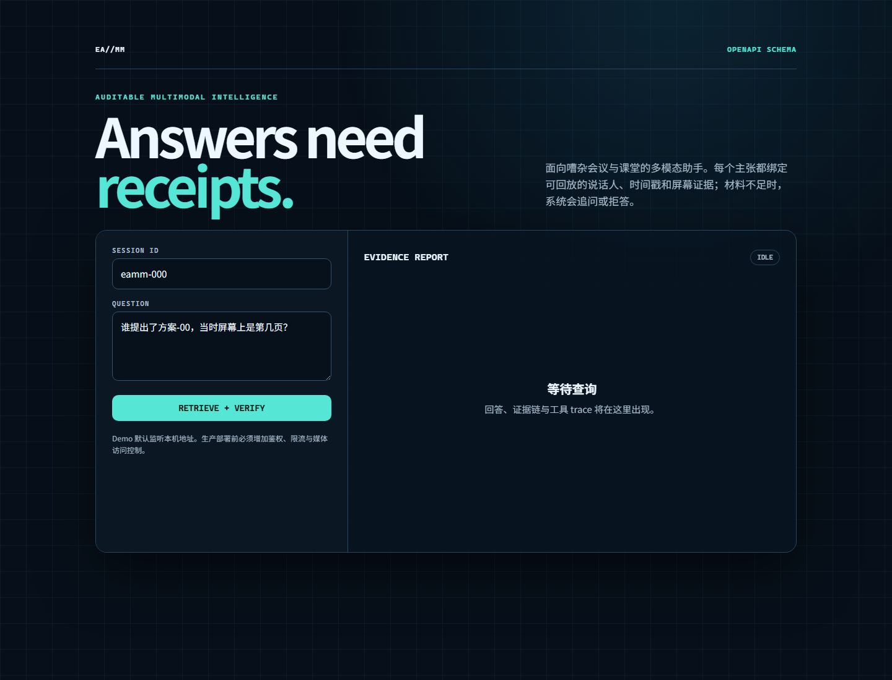

# EvidenceAgent-MM：可验证多模态会议助手

用户可以问“谁在什么时候提出了什么方案、屏幕上是哪一页、依据是什么”。系统不会只生成一段摘要，而是返回逐主张引用、音视频时间戳、匿名说话人、屏幕页码、置信度和工具调用轨迹。



证据门有三种输出：

1. `answered`：证据充分，每个 claim 都能回放；
2. `needs_clarification`：问题存在可消除的指代歧义，系统提出具体追问；
3. `abstained`：缺少必要模态或独立支持，系统明确说明缺什么。

## 本地运行

```bash
python -m venv .venv
source .venv/bin/activate
pip install -e '.[dev]'
make benchmark
eamm --db /tmp/eamm.db serve
```

浏览器打开 `http://127.0.0.1:8000`。未经鉴权时不要监听公网地址。

## 已验证边界

- 12 场、120 问的 CC0 合成 Bronze contract benchmark 已完整运行；
- 三态控制流和 Evidence Recall@5 均为 1.0；
- 这些数字不代表真实会议泛化能力；
- 当前置信度尚未校准，ECE-10 约为 0.413，必须在独立 validation set 上校准后才能作为产品分数。

## AutoDL RTX 4090 实测

| 组件 | 合成样例结果 | 热缓存耗时 | 证据文件 |
|---|---|---:|---|
| faster-whisper small | 2 个时间戳片段，WER 0.125 | 1.59 秒 | `benchmarks/results/gpu/asr_small_4090.json` |
| BGE-M3 | 中英查询目标排第 1，分数 0.625 | 7.71 秒 | `benchmarks/results/gpu/bge_m3_4090.json` |
| Qwen3-8B | 两个证据 ID 与必需事实均保留 | 加载 9.62 秒，生成 2.58 秒；峰值显存 15,665 MiB | `benchmarks/results/gpu/qwen3_8b_4090.json` |
| PaddleOCR 3.7 | 两页产生 6 条证据，6 个稳定且唯一的 ID | 2.46 秒 | `benchmarks/results/gpu/ocr_4090.json` |
| 能量式语音段检测 | 2/2 个语音段，平均时间 IoU 0.914 | CPU 兜底路径 | `benchmarks/results/gpu/diarization_fallback_smoke.json` |

以上仅是一个 12.4 秒合成视频上的集成验证。ASR 把 `review` 识别成了 `renew`；移动版 OCR 在第一页漏掉 `42 ms`，并把 `latency` 识别为 `Iatency`；无许可门槛的兜底方案只能切分语音段，连续编号不能当作跨片段复用的说话人身份。pyannote Community-1 仍是需要用户接受模型条款和提供 Hugging Face token 的可选路径。

确定性 CPU API 在本地完成 200 请求、并发 16、零失败，吞吐 144.7 req/s、P95 235.8 ms；同一路径在 AutoDL 为 234.5 req/s、P95 137.0 ms。这些吞吐数字不包含 GPU 模型推理，也不代表产品容量。

## 质量门

当前核心测试共 29 项，覆盖率门槛为 80%；Ruff、格式检查、Mypy、构建和干净 wheel 安装均纳入发布检查。GPU 适配器通过独立脚本和带 revision 的 JSON 报告验证。

架构、数据、模型和安全细节分别见 `docs/ARCHITECTURE.md`、`docs/DATASET_CARD.md`、`docs/MODEL_CARD.md` 和 `SECURITY.md`。
