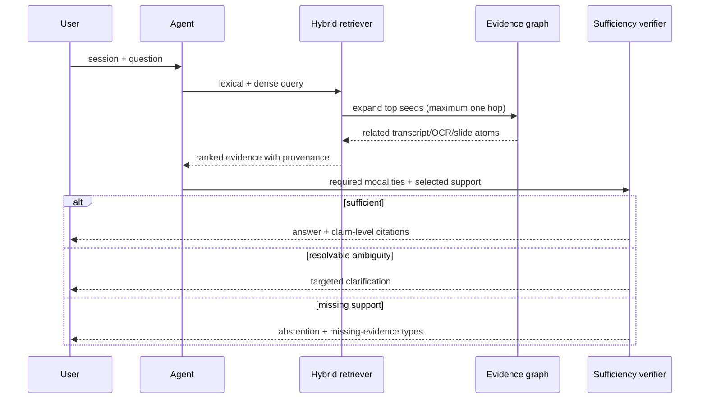

# Architecture

## Invariants

1. Raw media is immutable.
2. Every `EvidenceAtom` has a session, modality, source URI, and valid time interval.
3. Every answer claim references citation IDs present in the response.
4. Retrieval and generation cannot change source timestamps.
5. Missing or conflicting evidence is a valid terminal state.
6. Tool calls are bounded and retained in the response trace.

## Data flow

## Why graph expansion is bounded

Unbounded traversal can turn one weak match into a large, apparently authoritative context. v0.1 permits one hop and records `graph_distance`. Production experiments must compare zero, one, and two hops, with unsupported answer rate as a guardrail.

## Adapter boundary

The core package consumes typed atoms. ASR, diarization, OCR, embedding, reranking, and generation are adapters with lazy imports. This keeps CPU CI deterministic and lets AutoDL isolate CUDA-incompatible stacks.

## Production delta

SQLite is the tested reference store. A high-volume deployment should preserve the same schema while moving evidence rows to PostgreSQL, dense vectors to pgvector HNSW, raw media to object storage, and jobs to an explicit worker queue. Exact search must remain available to measure approximate-index recall.
